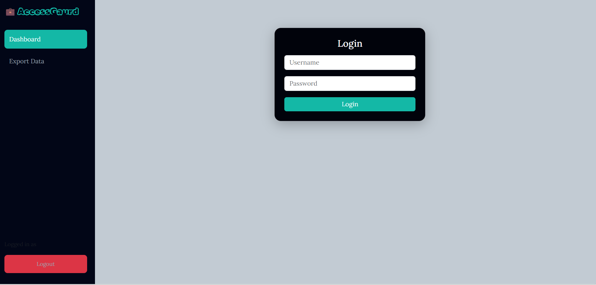
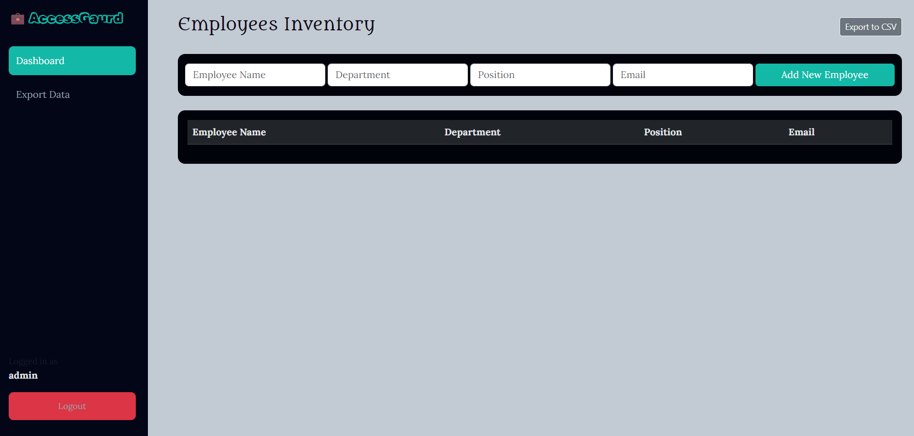

#AccessGaurd - Employee Inventory System

##Short Description
A Flask-Based Employee Inventory Management System with authentication , Admin access , and CRUD Functionality.
Designed to manage employee records efficiently with a clean dashboard UI.

##Features

- User authentication(Login , Logout)
- Admin-protected dashboard
- Add employee details
- View employee Inventory
- Delete employee records
- Confirmation alert before delete
- Responsive UI using Bootstrap

##Tech Stack

- Backend : Flask(Python)
- Frontend : HTML,CSS,Bootstrap
- Database : SQLite
- Authentication : Flask-Login

##Project Structure

AccessGuard/
│── app.py
│── instance/
│   └── stockflow.db
│── templates/
│   ├── base.html
│   ├── login.html
│   ├── dashboard.html
│── static/css
│          └── style.css

##Installation And Setup

#clone the repository
git clone [https://github.com/omchavan27/AccessGaurd-Staff-Portal.git]
(https://github.com/omchavan27/AccessGaurd-Staff-Portal.git)

#navigate into Project
cd accessgaurd

#create virtual enviornment
python -m venv enviornment

#activate virtual enviornment
venv\Scripts\Activate.ps1

#run the app
python app.py

##Usage
- login using admin credentials
- Access dashboard
- Add employee details
- Delete employee details

##Screenshots

##Future Inprovements
- Edit employee details
- Role-based access control
- Email notification
- Search and filter employees

##Author 
- Om Chavan
-GitHub : https://github.com/omchavan27